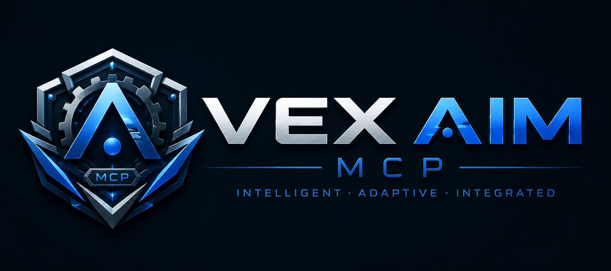
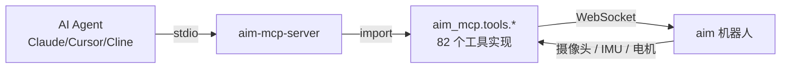

# VEX AIM MCP Server

<p align="center">
  
</p>


[](https://www.python.org/)
[](https://modelcontextprotocol.io/)
[](LICENSE)
[](aim_mcp_server)

> **让任何 AI Agent 一句话就能控制 VEX AIM 机器人。**

## 关于作者 & 项目初心

Hi，我是 **DongZi**，一名 **初二** 的学生，也是一名 VEX 爱好者 🦾。

[VEX AIM](https://www.vexrobotics.com/aim) 是我接触到的第一款"开箱即用 + AI 视觉 + Python 编程"的机器人 —— 它比 V5 更亲民，比 IQ 更智能，自带 WebSocket 接口和完整 Python API。

我一直在想：能不能让 AI 真正"看见"这个机器人、跟它"对话"？

所以我做了 **VEX AIM MCP Server** —— 把 AIM 的全部能力封装成 [Model Context Protocol (MCP)](https://modelcontextprotocol.io/) 标准接口，让 **Claude / Cursor / Cline / OpenClaw** 等任何 AI Agent 都能用自然语言直接控制它：

```
👤 "AIM，把屏幕上的眼睛换成爱心，再闪一下红灯"
🤖 [调用 aim_show_emoji(HEART) → aim_set_led(ALL, RED) → aim_blink_led(RED, 500)]
🤖 "好的，眼睛已经换成爱心、红色 LED 闪烁。"
```

我希望这个项目能：

- 🎓 **帮助更多 VEXer 入门 AIM** —— 不用先学 Python 也能玩转
- 🎉 **让 VEX 比赛 / 训练更有趣** —— AI 帮你调参、找球、写策略
- 🚀 **让 AI 真正理解机器人** —— 推动 AI × 机器人教育融合

如果你也是 VEXer，欢迎 Star ⭐ / Issue / PR，一起让 AIM 更好玩！

---

## 这是什么

[VEX AIM](https://www.vexrobotics.com/aim) 是 VEX Robotics 推出的教育机器人，自带 WebSocket 接口和完整的 Python API。本项目基于 [Model Context Protocol (MCP)](https://modelcontextprotocol.io/) 标准，把这套 API 封装成 **82 个标准 MCP 工具 + 3 个 Resources + 3 个 Prompts**，让任何支持 MCP 的 AI Agent（Claude Desktop、Cursor、Cline 等）都能用自然语言直接控制 AIM 机器人。

底层通信走 WebSocket，**无需安装额外驱动**；上层接口走 MCP stdio，**与主流 AI 客户端开箱即用**。

## 🤖 让 AI Agent 一键帮你接入 MCP（推荐）

> **最省事的方式**：把下面这段提示词**整段复制**，直接发给你的 AI Agent（Claude / Cursor / Cline / OpenClaw / Trae 等任何支持 MCP 的客户端）。Agent 会一步步问你要信息、克隆仓库、安装依赖、改配置——你只需要回答它的问题就行。

<details>
<summary>📋 点击展开 / 复制提示词</summary>

````text
你是一名 MCP 集成助手，请帮我把 VEX AIM MCP 服务器接入到你当前的客户端。
请严格按以下顺序执行，每完成一步暂停让我确认，再进入下一步。

==============================================================
阶段 0：环境探测（先看清楚再做）
==============================================================
1. 探测操作系统：`uname -a`（macOS/Linux）或 `ver`（Windows）。
2. 探测 Python 版本：`python3 --version`（需 ≥ 3.10；不足请提示我安装或换机器）。
3. 探测包管理：`which pip` / `which uv` / `which pipx`（推荐 `uv`，没有就用 `python3 -m pip`）。
4. 探测是否已有 VEX 仓库：`ls -la | grep -i vex-aim`；若有则跳到阶段 2。
5. 探测网络：能否访问 `github.com`（`curl -I https://github.com`）；不能则提示我开代理或离线传包。
6. 探测 git：`git --version`；没有就提示我先装 git。
7. 探测 git submodule 支持：`git submodule --version`（用于拉取 VEX 官方库）。
8. 把探测结果汇总成 1 行摘要告诉我（例如 "macOS 14 / Python 3.12 / pip / 已有仓库"）。

==============================================================
阶段 1：克隆 & 安装
==============================================================
1. 问我要 VEX AIM 机器人的 IP 地址：
   - 电脑直连机器人 AP 热点 → 通常是 `192.168.4.1`
   - 机器人和电脑同 Wi-Fi → 在机器人 Dashboard 或路由器后台查
   - 不知道就先用 `192.168.4.1` 占位，后面可改
2. 克隆仓库到 ~/Projects/VEX-AIM-MCP（Windows 用 %USERPROFILE%\Projects\VEX-AIM-MCP）：
     git clone --recurse-submodules https://github.com/flashzdw/VEX-AIM-MCP.git ~/Projects/VEX-AIM-MCP
     cd ~/Projects/VEX-AIM-MCP
   （仓库地址已固定为 https://github.com/flashzdw/VEX-AIM-MCP；如果你用过 fork，忘了 --recurse-submodules，
     之后可以跑 `git submodule update --init` 补救）
3. 创建并激活虚拟环境（任选其一）：
     # 方式 A：venv
     python3 -m venv .venv
     source .venv/bin/activate         # macOS / Linux
     # .venv\Scripts\activate          # Windows PowerShell

     # 方式 B：uv（更快）
     uv venv .venv && source .venv/bin/activate
4. 安装依赖（务必按顺序）：
     pip install -e websocket/AIM_Websocket_Library
     pip install -e "aim_mcp_server[Pillow]"
   Windows 上若 `pip install -e` 报权限错，加 `--user`；若仍报 PEP 668，加
   `pip install --break-system-packages -e ...`（仅限本机 venv）。
5. 验证安装：
     which aim-mcp-server             # 应返回 .venv/bin/aim-mcp-server
     aim-mcp-server --help            # 能打印帮助即成功

==============================================================
阶段 2：选择你的客户端 + 写入 MCP 配置
==============================================================
根据你正在用的客户端，**只做其中一个**：

【A. Claude Desktop（macOS）】
  配置文件：~/Library/Application Support/Claude/claude_desktop_config.json
  写入：
  ```json
  {
    "mcpServers": {
      "aim": {
        "command": "<REPO_ROOT>/.venv/bin/aim-mcp-server",
        "env": {
          "AIM_ROBOT_HOST": "<填阶段 1 拿到的 IP>",
          "AIM_ROBOT_PORT": "80"
        }
      }
    }
  }
  ```
  `<REPO_ROOT>` 用绝对路径替换，例如 `/Users/<me>/Projects/VEX-AIM-MCP`。

【B. Claude Desktop（Windows）】
  配置文件：%APPDATA%\Claude\claude_desktop_config.json
  写入（同上，路径改 Windows 形式）：
  ```json
  {
    "mcpServers": {
      "aim": {
        "command": "C:\\Users\\<me>\\Projects\\VEX-AIM-MCP\\.venv\\Scripts\\aim-mcp-server.exe",
        "env": {
          "AIM_ROBOT_HOST": "<填阶段 1 拿到的 IP>",
          "AIM_ROBOT_PORT": "80"
        }
      }
    }
  }
  ```

【C. Cursor（项目级）】
  在 VEX-AIM-MCP 仓库根目录创建 .cursor/mcp.json：
  ```json
  {
    "mcpServers": {
      "aim": {
        "command": "<REPO_ROOT>/.venv/bin/aim-mcp-server",
        "env": {
          "AIM_ROBOT_HOST": "<填阶段 1 拿到的 IP>",
          "AIM_ROBOT_PORT": "80"
        }
      }
    }
  }
  ```

【D. Cline / OpenClaw / Trae / 其他通用 MCP 客户端】
  找该客户端文档里"自定义 MCP 服务器 / stdio transport"的配置位置，按
  Claude Desktop 同样的 JSON 格式写入即可（`command` + `env` 字段名一致）。

==============================================================
阶段 3：重启客户端 + 验证
==============================================================
1. 完全退出并重新打开你的 AI 客户端（不是最小化，是 Quit → 重开）。
2. 在新对话里问我："列出你看到的 aim_* 工具数量"。
3. 我应该看到 **82 个 aim_* 工具 + 3 个 Resources + 3 个 Prompts**。
4. 让我跑一下 `aim_get_battery_capacity()` 验证连接：
   - 若返回 0~100 的整数 → 成功 ✅
   - 若返回 "机器人未连接" → 进入阶段 4 排错
5. 让我跑一下 `aim_move_for(distance=100, direction=0, velocity=30, wait=True)`
   看看机器人是否真的前进 100mm。

==============================================================
阶段 4：常见失败 & 自动排错
==============================================================
- 工具列表是 0 个：
    1) 检查 `which aim-mcp-server` 路径是否和 JSON 里的 `command` 一字不差
    2) 在终端手动跑 `aim-mcp-server`，看是否立刻退出（会报 Python 异常）
    3) 若是 Windows，路径要用双反斜杠 `\\` 或单正斜杠 `/`
- "机器人未连接"：
    1) `ping <AIM_ROBOT_HOST>` 看通不通
    2) 机器人是否开机（屏幕亮着）
    3) 电脑和机器人是否在同一个 Wi-Fi（直连 AP 模式就连 AIM-XXXX 热点）
    4) 调 `aim_connect(host="<IP>")` 重新连一次
- `pip install -e` 报 PEP 668 / externally-managed-environment：
    1) 确认你**已经激活虚拟环境**（终端前应有 (.venv)）
    2) 还不行加 `--break-system-packages`（仅限本机虚拟环境）
- `ModuleNotFoundError: No module named 'vex'`：
    1) 你没装 VEX 底层库，回到阶段 1 第 4 步
    2) VEX 库作为本仓库的 git submodule，如果 `pip install -e` 找不到，
       先跑 `git submodule update --init` 再 pip install
- `aim_set_tag_detection` 一直返回空：
    1) AprilTag 默认关，必须先调 `aim_set_tag_detection(enable=True)`

==============================================================
阶段 5：交付
==============================================================
完成后给我一个 1 屏总结：
  - 安装路径
  - 客户端类型
  - AIM 机器人 IP
  - 验证结果（工具数 + 电池读数）
  - 注意事项 1~2 条（例如 "AprilTag 默认关"）

==============================================================
关于本 MCP 的快速备忘
==============================================================
- 工具数：82（运动 16 / 视觉 18 / 踢球 2 / LED 4 / 声音 5 / 屏幕 22 / 传感器 9 / 连接 6）
- Resources：3 个（aim://status / aim://battery / aim://position，只读）
- Prompts：3 个（search_and_grab_ball / navigate_to_tag / calibrate_and_test）
- AprilTag 检测默认关闭，使用 TAG_0~TAG_37 前必须先 `aim_set_tag_detection(enable=True)`
- 颜色签名先用 `aim_define_color_signature` 注册，再 `aim_set_color_detection(enable=True)` 启用
- `aim_blink_led` / `aim_show_emotion_sequence` 启动后台线程，停止需调
  `aim_stop_blink_led` / `aim_stop_emotion_sequence`
- `aim_set_led_brightness(brightness=0~100)` 后所有 `aim_set_led` 的 RGB 自动按倍率缩放
- 想换机器人：调 `aim_connect(host="新IP")`，无需重启 MCP
- 完整 82 工具简介：见下文"工具一览"小节；详细参数见 aim_mcp_server/aim_mcp/tools/ 源码 docstring
- 架构文档：docs/aim-mcp-architecture.md
- 给 Agent 用的 Skill：skills/aim-mcp-controller/SKILL.md

请开始阶段 0。如果某一步你需要我确认或提供信息（例如 IP、GitHub 用户名、操作系统），
请明确问我，不要自己假设。
````

</details>

---

## 特性一览

| 类别 | 数量 | 说明 |
| --- | --- | --- |
| **MCP Tools** | **82** | 运动 16 / 视觉 18 / 踢球 2 / LED 4 / 声音 5 / 屏幕 22 / 传感器 9 / 连接 6 |
| **MCP Resources** | **3** | `aim://status` / `aim://battery` / `aim://position` 只读状态查询 |
| **MCP Prompts** | **3** | `search_and_grab_ball` / `navigate_to_tag` / `calibrate_and_test` 模板工作流 |
| **传输协议** | stdio | 与 Claude Desktop / Cursor / Cline 等原生兼容 |
| **依赖** | `mcp[cli]>=1.0.0`、`pydantic>=2.0`、`vex` (本地) | Python 3.10+，可选 Pillow 用于图像叠加 |
| **底层通信** | WebSocket | VEX AIM 官方协议，无需额外驱动 |

## 整体架构



- **AI Agent**：通过 stdio 启动 MCP 客户端，按 MCP 协议发送 `tools/call` 请求。
- **aim-mcp-server**：监听 stdio，解析请求并分派到 82 个工具实现。
- **vex library**：本地 `websocket/AIM_Websocket_Library/vex`（作为 git submodule），提供 `Robot` 单例封装。
- **VEX AIM Robot**：实际硬件，通过 WebSocket 接收控制指令并返回状态 JSON。

## 快速开始

### 0. 前置条件

- **Python ≥ 3.10**
- **git ≥ 2.20**（含 submodule 支持）
- 已经在电脑上 `git clone` 仓库并 `git submodule update --init`（或克隆时加 `--recurse-submodules`）
- VEX AIM 机器人已开机，且电脑能 ping 通（直连 AP 模式连 `192.168.4.1`，同 Wi-Fi 模式查路由器）

### 1. 安装依赖

```bash
cd VEX-AIM-MCP

# 创建并激活虚拟环境
python3 -m venv .venv
source .venv/bin/activate            # macOS / Linux
# .venv\Scripts\activate             # Windows PowerShell

# 按顺序安装（vex 库必须先装）
pip install -e websocket/AIM_Websocket_Library
pip install -e "aim_mcp_server[Pillow]"
```

> Windows / PEP 668 报错：在 venv 内仍报 `error: externally-managed-environment` 时加 `--break-system-packages`。

### 2. 启动 MCP 服务器

开发模式（直接跑 stdio，AI 客户端会自己调它）：

```bash
aim-mcp-server
# 或等价：
python -m aim_mcp.server
```

### 3. 接入 AI Agent

把下面这段贴到你的 AI 客户端配置里（**路径改成你的实际路径**）：

```json
{
  "mcpServers": {
    "aim": {
      "command": "/Users/<me>/Projects/VEX-AIM-MCP/.venv/bin/aim-mcp-server",
      "env": {
        "AIM_ROBOT_HOST": "192.168.4.1",
        "AIM_ROBOT_PORT": "80"
      }
    }
  }
}
```

不同客户端的配置文件位置：

| 客户端 | 配置文件 |
| --- | --- |
| Claude Desktop (macOS) | `~/Library/Application Support/Claude/claude_desktop_config.json` |
| Claude Desktop (Windows) | `%APPDATA%\Claude\claude_desktop_config.json` |
| Cursor | 项目根 `.cursor/mcp.json` |
| Cline | `.cline/mcp_config.json` |
| OpenClaw / Trae | 参考该客户端的"MCP 服务器"配置面板 |

## 接入 AI Agent

配置文件（参见上方"快速开始 → 3. 接入 AI Agent"）写好后：

1. **完全退出** AI 客户端（不是最小化，是 Quit → 重开），让它重新加载 MCP 配置。
2. 新对话里问它："**你看到几个 `aim_*` 工具？**"
3. 应该看到 **82 个工具 + 3 个 Resources + 3 个 Prompts**。
4. 跑一下 `aim_get_battery_capacity()` 验证连接：
   - 返回 `0~100` 整数 → 成功 ✅
   - 返回 "机器人未连接" → 检查 IP / Wi-Fi

```python
# Agent 会看到的能力（节选）
[
    "aim_move_for",            # 前进/后退指定距离
    "aim_turn_for",            # 旋转指定角度
    "aim_kick",                # 踢球（SOFT / MEDIUM / HARD）
    "aim_get_vision_objects",  # 获取 AI 视觉检测结果
    "aim_set_tag_detection",   # 开启/关闭 AprilTag
    "aim_define_color_signature",
    "aim_show_emoji",          # 显示表情
    "aim_print_at",            # 屏幕打印
    "aim_blink_led",           # LED 闪烁
    "aim_play_sound",          # 播放音效
    "aim_get_battery_capacity",
    "aim_connect",             # 切换机器人
    ... 共 82 个
]
```

## 使用示例

让 AI 用自然语言控制 AIM 机器人：

| 你说 | AI 实际调用 |
| --- | --- |
| "前进 30 厘米" | `aim_move_for(distance=300, direction=0, velocity=40)` |
| "左转 90 度" | `aim_turn_for(angle=-90, velocity=30)` |
| "看面前有什么颜色的球" | `aim_get_vision_objects(SPORTS_BALL)` |
| "打开 Tag 检测" | `aim_set_tag_detection(enable=True)` |
| "用 SOFT 模式踢一下" | `aim_kick(strength=SOFT)` |
| "屏幕显示爱心表情" | `aim_show_emoji(HEART)` |
| "闪三下红光" | `aim_blink_led(RED, 500)` |
| "电量多少" | `aim_get_battery_capacity()` |

---

## 工具一览

| 模块 | 工具数 | 关键能力 |
| --- | --- | --- |
| 运动（Motion） | 16 | 全向移动、转向、矢量运动、位姿查询 / 重置 |
| 视觉（Vision） | 18 | 球 / 桶 / AprilTag 检测、摄像头抓拍、AprilTag 开关、扫描/测距/抓拍叠加、颜色签名/颜色码、对象计数与方位 |
| 踢球器（Kicker） | 2 | `aim_kick(SOFT/MEDIUM/HARD)`、`aim_place` |
| LED | 4 | 单颗 / 全部 LED 颜色、全局亮度倍率、闪烁（含停止） |
| 声音（Sound） | 5 | 内置音效、单音符、本地音频播放、停止 |
| 屏幕（Screen） | 22 | 文本打印、像素 / 矩形 / 圆绘制、表情显示、电池仪表盘、表情轮播、图片显示、字体切换、坐标原点 / 裁剪、进度条 |
| 传感器（Sensor） | 9 | 电池、IMU（加速度 / 角速度 / 姿态）、触摸坐标 |
| 连接（Connection） | 6 | 连接 / 断开 / 状态查询 / 端口设置 |

每个工具的详细参数请见 `aim_mcp_server/aim_mcp/tools/*.py` 源码中的 docstring。

## 文档导航

- [docs/aim-mcp-architecture.md](docs/aim-mcp-architecture.md) — 架构设计文档（含 Mermaid 图）
- [skills/aim-mcp-controller/SKILL.md](./skills/aim-mcp-controller/SKILL.md) — 写给 AI Agent 的使用 Skill
- [skills/vex-aim-programming/SKILL.md](./skills/vex-aim-programming/SKILL.md) — VEX AIM 编程参考 Skill（不依赖 MCP）

## 常见问题

<details>
<summary><b>Q：机器人连不上（"机器人未连接"）？</b></summary>

1. `ping <AIM_ROBOT_HOST>` 看通不通
2. 机器人屏幕是否亮着（开机）
3. 电脑和机器人是否在同一个 Wi-Fi（直连 AP 模式就连 `AIM-XXXX` 热点）
4. 调 `aim_connect(host="<IP>")` 重新连一次
</details>

<details>
<summary><b>Q：工具列表是 0 个？</b></summary>

1. 检查 `which aim-mcp-server` 路径是否和 JSON 里的 `command` 一字不差
2. 在终端手动跑 `aim-mcp-server`，看是否立刻退出（会报 Python 异常）
3. Windows 路径用 `\\` 或 `/`
4. 若报 `No module named 'vex'`：没装 VEX 底层库，或没初始化 submodule（`git submodule update --init`）
</details>

<details>
<summary><b>Q：AprilTag 一直接收不到？</b></summary>

默认关！必须先调 `aim_set_tag_detection(enable=True)` 才能用 `TAG_0~TAG_37`。
</details>

<details>
<summary><b>Q：自定义颜色识别？</b></summary>

1. `aim_define_color_signature(slot=1, r=255, g=0, b=0, hue_range=10)`
2. `aim_set_color_detection(enable=True)`
3. `aim_get_vision_objects(ALL_COLORS)`
</details>

## 路线图

- [x] 删除 AI 项目残留（语音对话 / 旧 STT 模型），只保留 MCP 核心
- [x] 重写 README，适配 GitHub + 详细 AI Agent 一键接入提示词
- [x] 新增 7 个视觉工具（扫描 / 测距 / 抓拍叠加 / 颜色签名 / 颜色码 / 计数 / 方位）
- [x] 新增 9 个屏幕工具（电池仪表 / 表情轮播 / 图片 / 字体 / 清行 / 原点 / 裁剪 / 进度条）
- [x] 修复 `aim_set_led_brightness` 为真·全局亮度倍率
- [x] 修复 `aim_blink_led` 加 stop 控制
- [x] 删除 2 个 mock 工具（`aim_set_vision_brightness` / `aim_set_vision_led_brightness`）
- [x] 顶层 `skills/` 目录（与项目相关的 skill）
- [x] 顶层 `docs/` 目录（架构文档）
- [x] 根 `.gitignore`（屏蔽 `.TRAE/`、venv、构建产物、测试产物、抓拍图片）
- [x] `websocket/AIM_Websocket_Library/` 改用 git submodule
- [ ] Web 控制台（远程调参 / 可视化）
- [ ] 录制 / 回放 AIM 行为

## 致谢

- [VEX Robotics](https://www.vexrobotics.com/) 出品 AIM 机器人
- [Model Context Protocol](https://modelcontextprotocol.io/) 提供统一标准
- [FastMCP](https://github.com/jlowin/fastmcp) 提供 Python SDK
- 我的 VEX 队友们一直支持我做这个项目

## License

[MIT](LICENSE)
