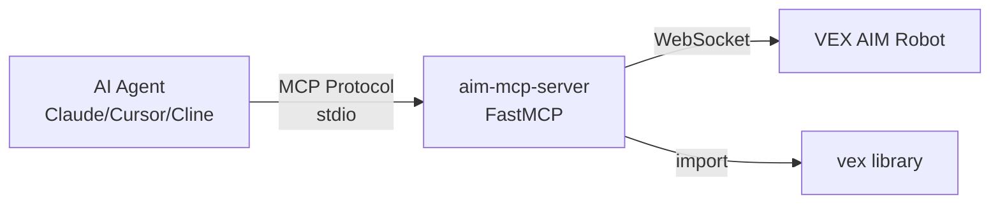

# AIM MCP Server

> 通过 [Model Context Protocol (MCP)](https://modelcontextprotocol.io/) 协议，让任意 AI Agent（Claude / Cursor / Cline 等）通过自然语言直接控制 VEX AIM 机器人。

## 项目简介

AIM MCP Server 是基于 [MCP (Model Context Protocol)](https://modelcontextprotocol.io/) 标准的服务器实现，将 VEX AIM 机器人底层的 Python API 封装为 **67 个标准 MCP 工具**、**3 个 Resources** 和 **3 个 Prompts**。任何支持 MCP 的 AI Agent 通过 stdio 传输即可调用，Agent 可基于用户自然语言指令自动完成"前进、转向、视觉识别、踢球、显示表情、播放音效"等机器人操作。

底层复用 `websocket/AIM_Websocket_Library/vex` 库，通过 WebSocket 与 VEX AIM 机器人通信，无需额外驱动。

## 特性一览

| 类别 | 数量 | 说明 |
| --- | --- | --- |
| **MCP Tools** | **64** | 覆盖运动 / 视觉 / 踢球 / LED / 声音 / 屏幕 / 传感器 / 连接 8 大模块 |
| **MCP Resources** | **3** | `aim://status` / `aim://battery` / `aim://position` 只读状态查询 |
| **MCP Prompts** | **3** | `search_and_grab_ball` / `navigate_to_tag` / `calibrate_and_test` 模板工作流 |
| **传输协议** | stdio | 与 Claude Desktop / Cursor 等编辑器原生兼容 |
| **依赖** | `mcp[cli]>=1.0.0`、`pydantic>=2.0`、`vex` (本地) | 仅 Python 3.8+ |
| **入口** | console script `aim-mcp-server` | 一条命令启动 |

## 整体架构



- **AI Agent**：通过 stdio 启动 MCP 客户端，按 MCP 协议发送 `tools/call` 请求。
- **aim-mcp-server**：监听 stdio，解析请求并分派到 61 个工具实现。
- **vex library**：本地 `websocket/AIM_Websocket_Library/vex`，提供 `Robot` 单例封装。
- **VEX AIM Robot**：实际硬件，通过 WebSocket 接收控制指令并返回状态 JSON。

## 安装步骤

```bash
# 1. 进入项目根目录
cd /Users/DONGZ/Documents/vex-vscode-projects/AiVision-Test

# 2. 创建并激活虚拟环境
python3 -m venv aim_mcp_venv
source aim_mcp_venv/bin/activate

# 3. 先安装本地 vex 库（AIM WebSocket 客户端）
pip install -e websocket/AIM_Websocket_Library

# 4. 再安装本 MCP 服务器（自动安装 mcp 与 pydantic）
pip install -e aim_mcp_server
```

> 提示：`pip install -e` 会以可编辑模式安装，便于修改源码后立即生效。

## 运行方法

### 方式 1：直接启动（控制台查看日志）

```bash
# 需先激活虚拟环境
source aim_mcp_venv/bin/activate
aim-mcp-server
```

### 方式 2：作为模块运行

```bash
python -m aim_mcp.server
```

### 环境变量

| 变量 | 必填 | 默认 | 说明 |
| --- | --- | --- | --- |
| `AIM_ROBOT_HOST` | 否 | `192.168.0.85`（`vex/settings.json`） | AIM 机器人 IP / 主机名。AP 模式下推荐 `192.168.4.1`。启动后也可通过工具 `aim_connect(host=...)` 运行时切换。 |
| `AIM_ROBOT_PORT` | 否 | `80` | WebSocket 端口。当机器人或反向代理使用非标准端口时设置。启动后可通过 `aim_connect(host, port)` 或 `aim_set_port(port)` 运行时切换。 |

```bash
# 示例：连接 192.168.1.100:8080 的机器人
export AIM_ROBOT_HOST=192.168.1.100
export AIM_ROBOT_PORT=8080
aim-mcp-server
```

> **端口说明**：VEX AIM 库的 `Robot(host)` 内部将 WebSocket URI 硬编码为 `ws://{host}/{ws_name}`（默认 80）。本 MCP 服务器通过将端口拼接到 host 字符串（`host:port` 形式）来支持自定义端口，无需修改 vex 库本身。

## 工具总览

### 1. 运动控制（Motion，16 个）

| 工具名 | 主要参数 | 返回 | 说明 |
| --- | --- | --- | --- |
| `aim_move_at` | `direction`, `velocity?`, `unit` | str | 持续沿指定角度（-360~360°）移动，需后续 `aim_stop` |
| `aim_move_for` | `distance`, `direction`, `velocity?`, `unit`, `wait` | str | 沿指定角度移动指定距离（毫米），可阻塞等待 |
| `aim_move_with_vectors` | `forwards`, `rightwards`, `rotation` | str | 全向向量运动，三轴速度 -100~100 |
| `aim_turn` | `direction`, `velocity?`, `unit` | str | 持续旋转，direction 为 `LEFT`/`RIGHT` |
| `aim_turn_for` | `direction`, `angle`, `velocity?`, `unit`, `wait` | str | 转向指定角度，可阻塞等待 |
| `aim_turn_to` | `heading`, `velocity?`, `unit`, `wait` | str | 转向绝对朝向（度） |
| `aim_stop` | — | str | 立即停止所有运动 |
| `aim_spin_wheels` | `v1`, `v2`, `v3` | str | 直接控制三个轮子速度 |
| `aim_set_move_velocity` | `velocity`, `unit` | str | 设置默认移动速度 |
| `aim_set_turn_velocity` | `velocity`, `unit` | str | 设置默认转向速度 |
| `aim_set_xy_position` | `x`, `y` | str | 设置机器人位姿原点 |
| `aim_get_position` | — | dict | 获取 `{x, y}` 位置（毫米） |
| `aim_get_heading` | — | float | 获取当前朝向（度） |
| `aim_get_rotation` | — | float | 获取累计旋转角度 |
| `aim_set_heading` | `heading` | str | 设置当前朝向值 |
| `aim_reset_heading` | — | str | 朝向重置为 0 |

### 2. 视觉感知（Vision，13 个）

| 工具名 | 主要参数 | 返回 | 说明 |
| --- | --- | --- | --- |
| `aim_get_vision_objects` | `object_type`, `count` | list[dict] | 获取视觉检测结果，支持 `SPORTS_BALL` / `BLUE_BARREL` / `ORANGE_BARREL` / `AIM_ROBOT` / `TAG_0~TAG_37` / `ALL_TAGS` / `ALL_OBJECTS` / `ALL_COLORS` / `ALL_CARGO` |
| `aim_has_sports_ball` | — | bool | 是否已抓到球 |
| `aim_has_blue_barrel` | — | bool | 是否已抓蓝桶 |
| `aim_has_orange_barrel` | — | bool | 是否已抓橙桶 |
| `aim_has_any_barrel` | — | bool | 是否已抓任意桶 |
| `aim_get_camera_image` | `output_path` | str | 抓取当前摄像头帧并保存为 JPG |
| `aim_set_vision_brightness` | `brightness` | str | 设置视觉传感器亮度（0~100） |
| `aim_set_vision_led_brightness` | `brightness` | str | 设置视觉 LED 亮度（0~100） |
| `aim_show_vision_on_screen` | — | str | 屏幕显示 AI 视觉画面 |
| `aim_hide_vision_on_screen` | — | str | 屏幕隐藏 AI 视觉画面 |
| **`aim_set_tag_detection`** | `enable` | str | ⚠️ 开启/关闭 AprilTag 检测。**机器人出厂默认关闭**，使用 `TAG_0~TAG_37` 之前必须先 `enable=True` |
| `aim_set_color_detection` | `enable`, `merge?` | str | 开启/关闭颜色和颜色码对象检测（默认关闭） |
| `aim_set_model_detection` | `enable` | str | 开启/关闭 AI 模型对象检测（球/桶/机器人，默认开启） |

> ⚠️ **AprilTag 识别问题排查**：如果调用 `aim_get_vision_objects(object_type="TAG_5")` 一直返回 `[]` 而球能正常识别，99% 是因为没先调 `aim_set_tag_detection(enable=True)`。球走的是 AI 模型检测（默认开），AprilTag 走的是独立的 tag 处理（默认关）。

### 3. 踢球器（Kicker，2 个）

| 工具名 | 主要参数 | 返回 | 说明 |
| --- | --- | --- | --- |
| `aim_kick` | `force` | str | 踢球，力度 `SOFT` / `MEDIUM` / `HARD` |
| `aim_place` | — | str | 轻柔放置前方物体 |

### 4. LED 控制（LED，3 个）

| 工具名 | 主要参数 | 返回 | 说明 |
| --- | --- | --- | --- |
| `aim_set_led` | `target`, `color?`, `r?`, `g?`, `b?` | str | 设置 LED 颜色（target 为 `ALL` 或 `0~5`） |
| `aim_set_led_brightness` | `brightness` | str | 设置 LED 亮度（0~100） |
| `aim_blink_led` | `color`, `interval_ms` | str | LED 闪烁（线程实现） |

### 5. 声音（Sound，5 个）

| 工具名 | 主要参数 | 返回 | 说明 |
| --- | --- | --- | --- |
| `aim_play_sound` | `sound_type`, `volume` | str | 播放内置音效（`DOORBELL` / `TADA` / `FAIL` / `SPARKLE` 等） |
| `aim_play_note` | `note`, `duration`, `volume` | str | 播放单音符（如 `C5` / `F#6`） |
| `aim_play_sound_file` | `filepath`, `volume` | str | 播放本地 wav/mp3（最大 255KB） |
| `aim_stop_sound` | — | str | 停止当前声音 |
| `aim_is_sound_playing` | — | bool | 是否正在播放声音 |

### 6. 屏幕（Screen，13 个）

| 工具名 | 主要参数 | 返回 | 说明 |
| --- | --- | --- | --- |
| `aim_print_screen` | `text` | str | 在光标位置打印文本 |
| `aim_print_at` | `text`, `x`, `y` | str | 在指定坐标打印文本 |
| `aim_clear_screen` | `color` | str | 清空屏幕并设置背景色 |
| `aim_set_cursor` | `row`, `column` | str | 设置光标位置 |
| `aim_set_pen_color` | `color` | str | 设置画笔颜色 |
| `aim_set_fill_color` | `color` | str | 设置填充颜色 |
| `aim_set_pen_width` | `width` | str | 设置画笔宽度（像素） |
| `aim_draw_pixel` | `x`, `y` | str | 画一个像素 |
| `aim_draw_line` | `x1`, `y1`, `x2`, `y2` | str | 画一条直线 |
| `aim_draw_rectangle` | `x`, `y`, `width`, `height` | str | 画一个矩形 |
| `aim_draw_circle` | `x`, `y`, `radius` | str | 画一个圆 |
| `aim_show_emoji` | `emoji`, `look` | str | 显示表情，支持 `look` 朝向 |
| `aim_hide_emoji` | — | str | 隐藏表情 |

### 7. 传感器（Sensor，9 个）

| 工具名 | 主要参数 | 返回 | 说明 |
| --- | --- | --- | --- |
| `aim_get_battery_capacity` | — | int | 电池剩余容量百分比 |
| `aim_get_acceleration` | `axis` | float | IMU 加速度（X/Y/Z） |
| `aim_get_turn_rate` | `axis` | float | 角速度（DPS，X/Y/Z） |
| `aim_get_roll` | — | float | IMU roll 角（度） |
| `aim_get_pitch` | — | float | IMU pitch 角（度） |
| `aim_get_yaw` | — | float | IMU yaw 角（度） |
| `aim_is_screen_pressed` | — | bool | 屏幕是否被触摸 |
| `aim_get_touch_x` | — | float | 最近触摸 X 坐标 |
| `aim_get_touch_y` | — | float | 最近触摸 Y 坐标 |

### 8. 连接管理（Connection，6 个）

| 工具名 | 主要参数 | 返回 | 说明 |
| --- | --- | --- | --- |
| `aim_connect` | `host`, `port?` | str | 连接指定 host（可指定 WebSocket 端口），自动断开旧连接 |
| `aim_disconnect` | — | str | 断开当前连接 |
| `aim_is_connected` | — | bool | 是否已连接 |
| `aim_set_port` | `port?` | str | 仅修改端口设置（不立即重连），传入 `None` 恢复默认 80 |
| `aim_get_port` | — | int \| null | 查询当前显式设置的端口（未设置返回 `null`） |
| `aim_get_effective_port` | — | int | 查询实际生效的端口（考虑环境变量和默认值） |

**端口使用示例**：

```text
# 启动时设置（环境变量）
export AIM_ROBOT_PORT=8080

# 运行时切换
aim_set_port(8080)             # 改为 8080
aim_connect(host="10.0.0.5", port=8080)   # 同时设置 host 和 port
aim_get_effective_port()       # 查询当前生效端口
aim_set_port()                 # 传 None 恢复默认 80
```

> 端口取值范围 1-65535；非整数、超出范围或类型错误会返回 "端口无效: …" 中文错误。

## AI Agent 接入配置

### Claude Desktop

编辑 `~/Library/Application Support/Claude/claude_desktop_config.json`：

```json
{
  "mcpServers": {
    "aim": {
      "command": "/Users/DONGZ/Documents/vex-vscode-projects/AiVision-Test/aim_mcp_venv/bin/aim-mcp-server",
      "env": {
        "AIM_ROBOT_HOST": "192.168.1.100"
      }
    }
  }
}
```

修改后重启 Claude Desktop，即可在工具列表中看到所有 `aim_*` 工具。

### Cursor

在项目根目录的 `.cursor/mcp.json` 中加入：

```json
{
  "mcpServers": {
    "aim": {
      "command": "/Users/DONGZ/Documents/vex-vscode-projects/AiVision-Test/aim_mcp_venv/bin/aim-mcp-server",
      "env": {
        "AIM_ROBOT_HOST": "192.168.1.100",
        "AIM_ROBOT_PORT": "80"
      }
    }
  }
}
```

### Cline / 其他 MCP 客户端

只要支持 `command` 启动 stdio 进程即可，配置格式与上述相同。

## 使用示例

> 假设你正在与 Claude Desktop 对话，下方"用户输入"→"Agent 内部调用"展示完整的工具链路。

### 1. 简单运动："前进 1 米后停止"

**用户输入**：

> "请让 AIM 机器人前进 1 米后停下。"

**Agent 内部调用**：

```python
# 距离 1 米 = 1000 毫米，沿 0°（正前方）方向
aim_move_for(distance=1000, direction=0, velocity=50, wait=True)
```

### 2. 找球抓取："找到球并抓取"

**用户输入**：

> "找到场地上的 SportsBall 然后抓起来。"

**Agent 内部调用**：

```python
objs = aim_get_vision_objects(object_type="SPORTS_BALL", count=3)
# objs[0]["centerX"] / objs[0]["bearing"] 用于对准
aim_turn_to(heading=bearing_offset, wait=True)
aim_move_for(distance=200, direction=0, wait=True)
aim_has_sports_ball()        # 验证是否抓到
aim_kick(force="MEDIUM")     # 抓到后踢出
```

### 3. AprilTag 导航："导航到 AprilTag 5"

**用户输入**：

> "走到 AprilTag 5 旁边。"

**Agent 内部调用**：

```python
# 0. 【必须】先开启 AprilTag 检测（机器人出厂默认关闭）
aim_set_tag_detection(enable=True)

tag = aim_get_vision_objects(object_type="TAG_5", count=1)
# 循环：读取 bearing → 转向 → 短距前进 → 重新检测
aim_turn_to(heading=current_heading + tag[0]["bearing"], wait=True)
aim_move_for(distance=150, direction=0, wait=True)
```

### 4. 屏幕表情："显示开心表情"

**用户输入**：

> "在机器人屏幕上显示一个向前看的开心表情。"

**Agent 内部调用**：

```python
aim_show_emoji(emoji="HAPPY", look="LOOK_FORWARD")
```

### 5. 播放音符："播放音符 C5"

**用户输入**：

> "让机器人播放 1 秒钟的 C5 音符。"

**Agent 内部调用**：

```python
aim_play_note(note="C5", duration=1000, volume=60)
```

## 故障排查

| 现象 | 可能原因 | 处理建议 |
| --- | --- | --- |
| 工具返回"机器人未连接" | IP 错误 / 不在同一 Wi-Fi / 机器人未开机 | 1) 用 `aim_connect(host="192.168.x.x")` 重新连接；2) 确认机器人与电脑在同一局域网；3) 长按机器人电源键确认开机 |
| Claude Desktop 工具列表中没有 `aim_*` | MCP 服务器未启动 | 1) 检查 `command` 路径是否正确；2) 用终端手动执行 `aim-mcp-server` 验证能否启动；3) 查看 Claude 日志（`~/Library/Logs/Claude/`） |
| 视觉检测返回空列表 | 光线不足 / 目标距离过远 / 目标在画面外 | 1) 提高环境光或开启视觉 LED（`aim_set_vision_led_brightness(80)`）；2) 调整机器人角度与距离；3) 确认目标在画面中央 |
| `aim_move_for` 超时 | 电池电量低 / 轮子被卡 / 目标距离过大 | 1) 调用 `aim_get_battery_capacity()` 检查电量；2) 物理检查轮子；3) 拆分为多次短距离移动 |
| `aim_kick` 报错 | Kicker 内部状态异常 | 1) 调用 `aim_stop_sound()` 等其他 stop 工具复位；2) 重启机器人 |
| MCP 进程异常退出 | Python 环境损坏 | 重新 `pip install -e aim_mcp_server` |

## 项目结构

```
aim_mcp_server/
├── pyproject.toml              # 包元数据 + console script
├── requirements.txt            # 依赖列表
├── claude_desktop_config.json  # Claude Desktop 配置片段
├── README.md                   # 本文件
└── aim_mcp/
    ├── __init__.py
    ├── server.py               # FastMCP 入口，console script
    ├── connection.py           # Robot 单例 + 异常映射
    ├── resources.py            # 3 个 Resources
    ├── prompts.py              # 3 个 Prompts
    └── tools/
        ├── _decorators.py      # @register_tool 装饰器工厂
        ├── motion.py           # 16 个运动工具
        ├── vision.py           # 10 个视觉工具
        ├── kicker.py           # 2 个踢球工具
        ├── led.py              # 3 个 LED 工具
        ├── sound.py            # 5 个声音工具
        ├── screen_tools.py     # 13 个屏幕工具
        ├── sensors.py          # 9 个传感器工具
        └── connection_tools.py # 3 个连接工具
```

## 相关链接

- [MCP 协议规范](https://modelcontextprotocol.io/)
- [VEX AIM WebSocket Library](../websocket/AIM_Websocket_Library/)
- [.TRAE/skills/vex-aim-programming](../.TRAE/skills/vex-aim-programming/SKILL.md) — 编写 AIM 机器人 Python 代码的 Skill
- [.TRAE/documents/aim-mcp-architecture.md](../.TRAE/documents/aim-mcp-architecture.md) — 架构设计文档
