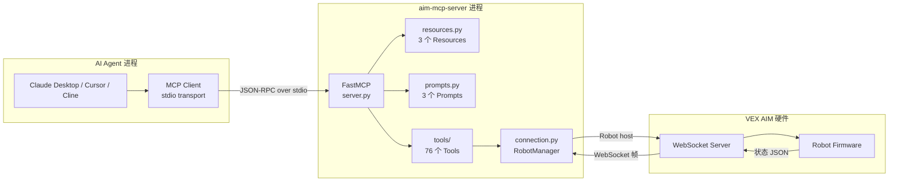
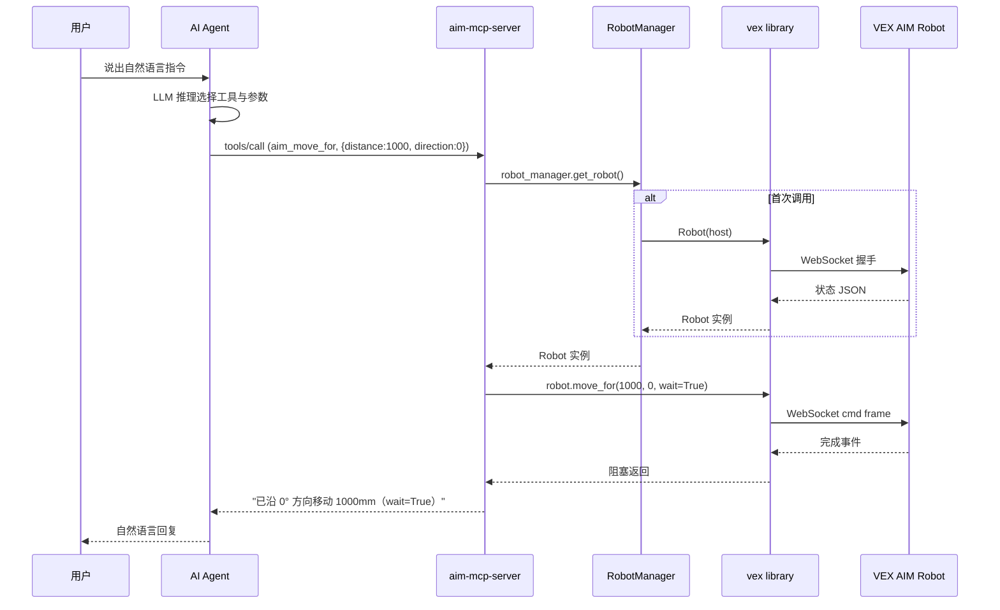
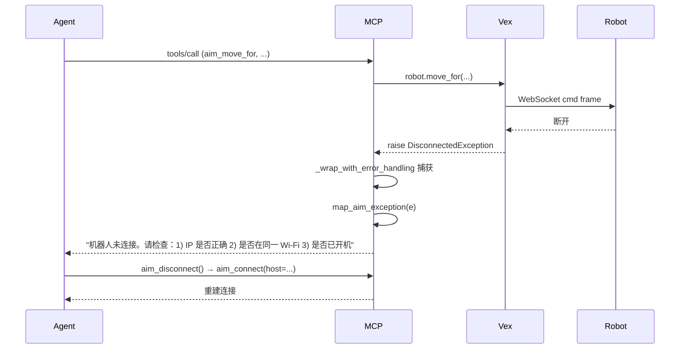
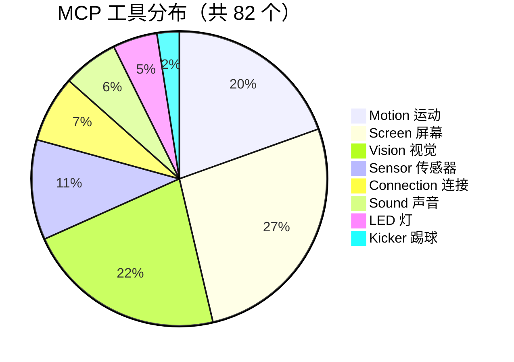
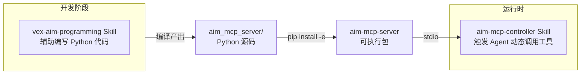
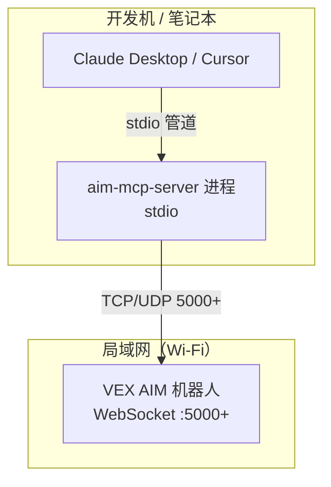

# AIM MCP Server 架构设计文档

> 路径：`docs/aim-mcp-architecture.md`
> 维护：SOLO Coder / 文档工程师
> 适用范围：`aim_mcp_server/` 模块

## 1. 项目背景

### 1.1 为什么需要 MCP

VEX AIM 机器人已有完善的 Python API（`websocket/AIM_Websocket_Library/vex`），开发者可通过编写 Python 脚本完成运动、视觉、踢球等任务。但在以下场景中仍存在明显短板：

| 场景 | 痛点 |
| --- | --- |
| 教学演示 | 学生需要在不写代码的前提下体验 AI + 机器人协作 |
| 远程调试 | 团队成员无法直接运行 Python 环境，但仍希望与机器人交互 |
| LLM 联动 | 主流 AI Agent（Claude / Cursor / Cline）原生支持 MCP 而非任意 Python 库 |
| 快速验证 | 临时性的"试试看"操作不必构建完整项目 |

**Model Context Protocol (MCP)** 是由 Anthropic 提出的开放标准，让 LLM 客户端通过统一协议调用工具、资源与提示词模板。我们将 VEX AIM 库封装为 MCP Server，即可让任何支持 MCP 的 AI Agent 用自然语言驱动机器人。

### 1.2 目标

- **零代码门槛**：用户用中文指令（如"前进 1 米"）即可控制机器人。
- **工具原子化**：67 个工具粒度尽量小，便于 Agent 自由组合。
- **可观测性**：通过 Resources 暴露机器人状态，便于 Agent 主动查询。
- **可扩展性**：模块化目录结构，新增工具只需在 `tools/` 下添加一个文件并用 `@register_tool` 装饰。

## 2. 整体架构



关键点：

- **进程隔离**：AI Agent 与 MCP Server 分属不同进程，通过 stdio JSON-RPC 通信，单边崩溃不影响另一边。
- **单例 Robot**：`RobotManager` 保证整个 MCP Server 进程内只有一个 `Robot` 实例，所有工具共享同一连接。
- **延迟连接**：首次调用任意工具时才建立 WebSocket；启动时无需机器人在线。
- **异常友好**：`map_aim_exception` 把底层 `DisconnectedException` 翻译成中文提示，便于 Agent 自我恢复。

## 3. 工具调用时序

以"前进 1 米"为例，展示一次完整工具调用的数据流：



异常分支（如 `DisconnectedException`）：



## 4. 模块依赖

```mermaid
graph TD
    Server[server.py<br/>FastMCP 入口] --> Tools[tools/]
    Server --> Resources[resources.py]
    Server --> Prompts[prompts.py]
    Server --> Conn[connection.py<br/>RobotManager]

    Tools --> Decorator[tools/_decorators.py<br/>@register_tool]
    Tools --> Conn
    Resources --> Conn
    Prompts --> Server
    Decorator --> Conn
    Conn --> Vex[vex library<br/>websocket/AIM_Websocket_Library/vex]

    Tools --> Motion[tools/motion.py<br/>16 工具]
    Tools --> Vision[tools/vision.py<br/>18 工具]
    Tools --> Kicker[tools/kicker.py<br/>2 工具]
    Tools --> Led[tools/led.py<br/>4 工具]
    Tools --> Sound[tools/sound.py<br/>5 工具]
    Tools --> Screen[tools/screen_tools.py<br/>22 工具]
    Tools --> Sensors[tools/sensors.py<br/>9 工具]
    Tools --> ConnTools[tools/connection_tools.py<br/>6 工具]
```

设计原则：

- **Tools 不直接 import `vex` 的副作用**：统一通过 `robot_manager.get_robot()` 访问，便于后续替换底层。
- **装饰器集中处理异常**：`_wrap_with_error_handling` 保证 76 个工具都得到一致的错误处理。
- **Resources / Prompts 独立注册**：它们不需要异常包装，可直接访问 `Robot`。

## 5. 工具分布



观察：

- **运动 + 屏幕 + 视觉**三类合计 56 个，占 68%，是日常交互的主要工具。
- **连接管理 6 个**虽少但关键，是所有工具的前置依赖。
- 扩展新工具时建议优先补充在 Sensor 或 Sound 类别，以填补目前较薄的覆盖。

## 6. 与现有 vex-aim-programming Skill 的关系

仓库中已有 `skills/vex-aim-programming/` Skill，用于**辅助开发者编写 AIM 机器人 Python 代码**。两者的定位互补：



| 维度 | vex-aim-programming Skill | aim-mcp-controller Skill |
| --- | --- | --- |
| **作用对象** | 开发者 | AI Agent |
| **触发场景** | 编写/调试 AIM 机器人脚本 | 用户用自然语言控制机器人 |
| **输出** | 代码片段 / 模板 / 文档 | 工具调用决策 |
| **依赖** | 无（纯文档） | 需 `aim-mcp-server` 已安装并运行 |
| **是否需连接机器人** | 否 | 是 |

简言之：**MCP 是动态调用层，Skill 是开发辅助层**。两者并存能同时服务"写代码的工程师"和"用自然语言的最终用户"。

## 7. 扩展指引

### 7.1 新增一个 MCP 工具

1. 在 `aim_mcp_server/aim_mcp/tools/` 下新建（或打开）一个模块文件，例如 `my_feature.py`。
2. 使用 `@register_tool` 装饰函数：

```python
from ._decorators import register_tool
from ..connection import robot_manager


@register_tool(
    name="aim_my_feature",
    description="一句话说明这个工具做什么。",
    read_only=False,    # 可选：readOnlyHint
    destructive=False,  # 可选：destructiveHint
    idempotent=False,   # 可选：idempotentHint
    open_world=True,    # 可选：openWorldHint
)
def aim_my_feature(arg1: str, arg2: int = 0) -> str:
    """
    详细描述（会与 description 合并作为 MCP 工具的 description）。
    """
    robot = robot_manager.get_robot()
    # ...调用 vex 库 API...
    return f"ok: {arg1}/{arg2}"
```

3. 确认 `aim_mcp/tools/__init__.py` 会自动 `import` 该文件（已通过 `from . import tools` 包导入触发所有模块的 `import` 副作用）。
4. 重新 `pip install -e aim_mcp_server` 即可热加载。
5. 重启 MCP 客户端（Claude Desktop / Cursor），新工具会自动出现在工具列表。

### 7.2 新增一个 Resource

在 `aim_mcp_server/aim_mcp/resources.py` 中仿照现有模板新增一个函数，并在 `register_all` 中调用：

```python
def get_my_resource(mcp):
    @mcp.resource("aim://my_resource", mime_type="application/json", ...)
    def my_resource() -> str:
        try:
            return json.dumps({...}, ensure_ascii=False)
        except Exception as e:
            from .connection import map_aim_exception
            return json.dumps({"error": map_aim_exception(e)}, ensure_ascii=False)
    return my_resource
```

### 7.3 新增一个 Prompt

在 `aim_mcp_server/aim_mcp/prompts.py` 的 `register_all` 函数中追加：

```python
@mcp.prompt(name="my_workflow", description="一句话说明工作流目标")
def my_workflow() -> list:
    return [PromptMessage(role="user", content={"type": "text", "text": "..."})]
```

### 7.4 错误处理统一约定

- 工具内**不要**直接 `try/except` 后返回字符串，依赖 `@register_tool` 的 `_wrap_with_error_handling` 统一处理。
- 业务校验失败（如参数超范围）可在函数内**显式 return 字符串**，因为这不算异常。
- 真异常会被 `_wrap_with_error_handling` 捕获并通过 `map_aim_exception` 转字符串。

## 8. 部署拓扑



- **同一台电脑**部署 IDE 与 MCP Server 是最常见模式。
- MCP Server 也可以跑在局域网内另一台机器上，通过 `command: "ssh ..."` 或自定义 wrapper 启动。
- 多个 AI Agent 共享同一台机器人时，每个 Agent 启动一个独立的 MCP Server 进程（每个进程独立 `RobotManager`），互不干扰。

## 9. 版本与变更

| 版本 | 日期 | 主要变更 |
| --- | --- | --- |
| 0.1.0 | 2026-06 | 首个发布版本：67 tools / 3 resources / 3 prompts |
| 0.2.0 | 2026-06 | 连接管理新增端口支持：`aim_connect(host, port?)` / `aim_set_port` / `aim_get_port` / `aim_get_effective_port`；新增 `AIM_ROBOT_PORT` 环境变量。工具数提升至 64。 |
| 0.3.0 | 2026-06 | 视觉新增 3 个检测开关：`aim_set_tag_detection` / `aim_set_color_detection` / `aim_set_model_detection`；修复 tag id 范围 0-36 → 0-37。**关键：AprilTag 默认关闭，使用前必须先开启**。工具数提升至 67。 |
| 0.4.0 | 2026-06 | 体检：清理 2 个 vision mock 工具；`aim_set_led_brightness` 实现为全局倍率；`aim_blink_led` 加 `aim_stop_blink_led`。视觉新增 4 个工具（V1~V4：扫描 / 测距 / 抓拍叠加 / 颜色签名）。屏幕新增 6 个工具（S1~S4：电池仪表盘 / 表情轮播 / 图片 / 字体 / 行清空）。新增 Pillow 依赖。**工具数提升至 76**。 |
| 0.5.0 | 2026-06 | 视觉新增 3 个轻量工具（V5 `aim_count_objects` / V6 `aim_get_object_bearing` / V7 `aim_define_color_code`）；屏幕新增 3 个绘图/排版工具（S5 `aim_set_screen_origin` / S6 `aim_set_screen_clip` / S7 `aim_draw_progress_bar`）；README 与架构文档工具数同步。**工具数提升至 82**。 |

后续变更请同步更新本文件与 `aim_mcp_server/pyproject.toml`。
